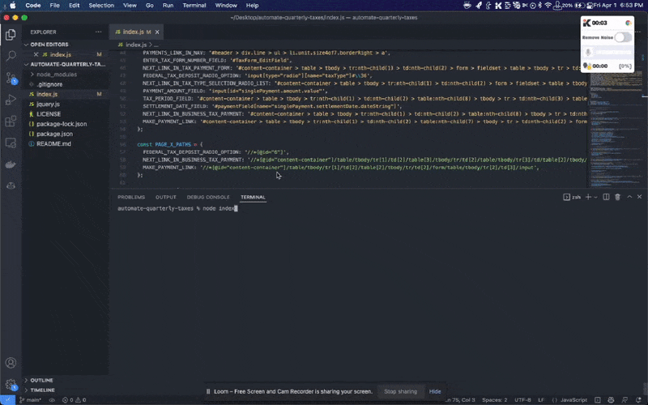

# automate-quarterly-taxes

Make your quarterly tax payments 3x faster with automation.

This is primarily useful if you're a founder who wants to save 10-20 minutes each time you schedule your quarterly federal tax payments on EFTPS (Corps and multi-member LLCs).

This is a Node.js script that opens up the EFTPS website in a browser (via `puppeteer`), loads `jQuery` on-page, and automatically takes you through the right commands and sequences until you are taken to the final confirmation screen. Then all you have to do is click 'Make Payment'.

**Please note: You'll need an [EFTPS](https://eftps.gov) account**.

# Quickstart:

1. Download [Chromium](https://www.chromium.org/getting-involved/download-chromium/), [Node.js](https://nodejs.org/en/), and [npm](npmjs.com)
2. Install dependencies: `npm install`
3. Open up the file `index.js` and update `USER` at line 8 with your EFTPS login details (9-digit EIN, PIN, and password)
4. Open up the file `index.js` and update `TAX_PAYMENT` at line 15 with your quarterly payment details (payment amount, tax period, and settlement date).
5. Run the main script: `node index`
6. The browser will open and take you to the final confirmation screen. Then click 'Make Payment' once everything looks good.
7. Repeat steps 4-6 until you are done with your quarterly taxes for the year.

# Background:

I hate making quarterly estimated tax payments. Original idea was posted on [Kernal](https://kern.al/idea/automate-corporate-quarterly-tax-payments-for-your-startup).

# Considerations:

- License is MIT (you are free to do whatever you'd like, personally or commercially)
- Although this script is made for corporate quarterly taxes (C-Corps and multi-member LLCs), you could modify the code to work for personal taxes. You'll want to change things like the `1120` instance at `CORPORATE_INCOME_TAX_RETURN_NUMBER`, as well as
- Legal note: You are responsible for making tax payments on-time and without violating any laws in your jurisdiction. You are also liable for your own actions regarding making quarterly tax payments.